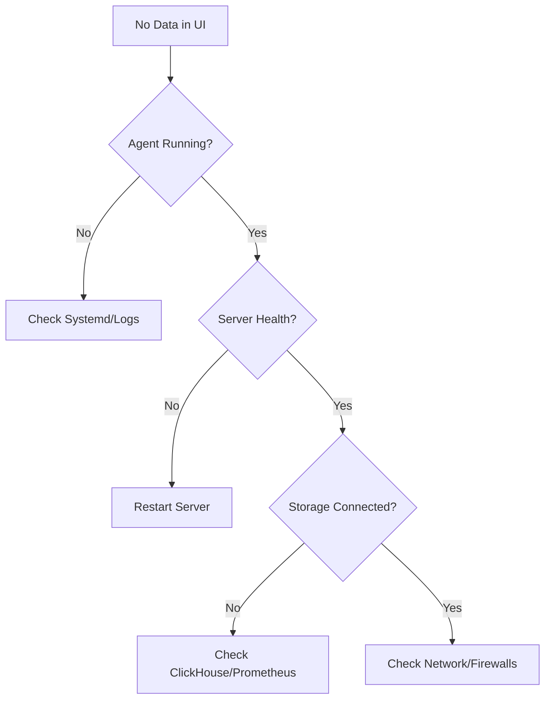

# RCA-App Operations Guide

This guide is intended for SRE and DevOps engineers responsible for deploying, scaling, and maintaining the RCA-App observability platform.

---

## 🚀 Installation and Setup

### 1. Kubernetes Deployment (Recommended)
Deploy using the provided Helm chart (located in `/deploy/helm/rca-app`):

```bash
helm install rca-app ./deploy/helm/rca-app \
  --namespace observability \
  --set server.apiKey="your-secure-api-key" \
  --set clickhouse.persistence.size=100Gi
```

### 2. Standalone Linux VM
Install the Node Agent using the native package:

```bash
# Ubuntu/Debian
sudo dpkg -i rca-node-agent.deb
sudo systemctl enable --now rca-node-agent

# RHEL/CentOS
sudo rpm -i rca-node-agent.rpm
sudo systemctl enable --now rca-node-agent
```

---

## ⚙️ Configuration Reference

### Server Environment Variables
| Variable | Description | Default |
|----------|-------------|---------|
| `RCA_API_KEY` | Primary authentication key | Required |
| `DB_PATH` | Path to SQLite database | `/data/rca.db` |
| `PROMETHEUS_URL` | Upstream Prometheus endpoint | `http://prometheus:9090` |
| `CLICKHOUSE_ADDR` | ClickHouse connection string | `localhost:9000` |
| `TLS_CERT_FILE` | Path to HTTPS certificate | None |

---

## 📈 Scaling Guidelines

### Horizontal Scaling
- **RCA-App Server**: Stateless and can be scaled horizontally using a Load Balancer.
- **ML Service**: Stateless; scale to handle concurrent analysis requests.

### Vertical Scaling
- **ClickHouse**: Scale CPU for query performance and Disk for log retention.
- **Prometheus**: Requires high memory for high cardinality metrics.

**Scalability Targets**: 
The architecture is verified for **1,000 nodes** and **10,000 services** with the following baseline resources:
- 114 CPU Cores
- 128GB RAM
- 600GB Disk

---

## 🛠 Troubleshooting

### Common Issues & Runbooks

#### 1. Node Agent Not Reporting
**Symptoms**: No data appearing in Service Map for specific nodes.
**Check**:
- Run `systemctl status rca-node-agent` on the host.
- Verify connectivity to the server: `curl -v http://rca-server:8080/health`.
- Check kernel version: `uname -r` (Requires 5.4+).

#### 2. ML Analysis Timeouts
**Symptoms**: AI Analysis remains in "Pending" state in Backstage.
**Check**:
- Verify `ml-service` logs for OOM or slow model inference.
- Check Prometheus query latency.

### Decision Tree: Data Gaps


---

## 🔒 Security Hardening

1. **Rotate API Keys**: Regularly update the `RCA_API_KEY` in your CI/CD secrets.
2. **Enable OIDC**: Configure your Identity Provider for SSO.
3. **Use TLS**: Always deploy with `TLS_CERT_FILE` in production.
4. **Minimal RBAC**: Grant `RoleViewer` by default to users.

---

## 🧹 Backup and Restore

### SQLite (Configs)
Backup the database file regularly:
```bash
cp /data/rca.db /backups/rca-$(date +%F).db
```

### ClickHouse (Telemetry)
Use `clickhouse-backup` tool for snapshots of the `rca` database.

---

## ⚡ Performance Tuning Checklist

- [ ] Enable **compression** in ClickHouse (`LZ4` recommended).
- [ ] Tune Prometheus **retention** to balance disk and history.
- [ ] Use **persistent volumes** on SSDs for ClickHouse.
- [ ] Configure **Resource Quotas** in Kubernetes for all components.
